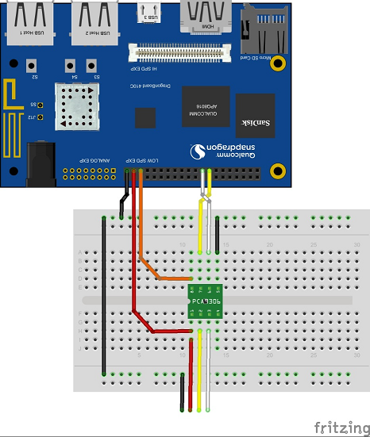

SensorsDemo.
=======================

 A sample GUI application and uses the Gesture, Light and Color sensor inputs to modify images on the Appl

## To build: 
 - Download a recent Android NDK build ( http://developer.android.com/ndk/downloads/index.html) 
 - Include the NDK installation folder to PATH variable.
 - Download a recent Android Studio release.
 - In the Android Studio startup page, select 'Open an existing Android Studio Project' to import the project.
 
 
## To Test:
 - Connect the Grove sensor with I2C interface. See Hardware set-up below.
 - Install the application via Android Studio or via 'adb install' command. 
 
## Observe: 
 - If successful, you should see a graphic image (Monkey) and the position, color and brightness of screen change.
 
## I2C sensor test setup:

 
