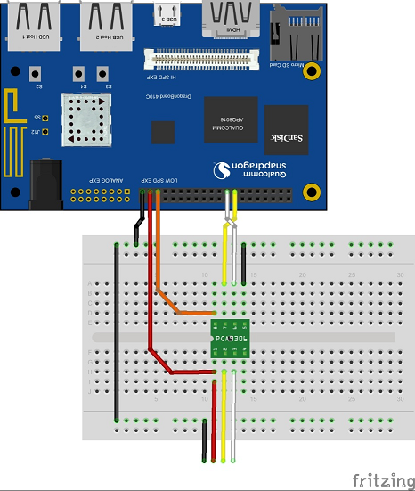

ADXL345 - Accelerometer.
=======================

 Driver files and sample NDK based (console) application for the Groove Accelerometer sensor (ADXL345).

## To build: 
 - Download a recent Android NDK build ( http://developer.android.com/ndk/downloads/index.html) 
 - Include the NDK installation folder to PATH variable.
 - Now run ndk-build to create the image files.
 
 
## To Test:
 - Connect the Grove sensor with I2C interface. See Hardware setup below.
 - adb root
 - adb remount
 - adb push libs/arm64-v8a/samples-adxl345 /system/bin
 - adb shell chmod 777 /system/bin/samples-adxl345
 
## Observe: 
 - If successful you should see a series of prints with the gesture that is detected.. 
 
## I2C sensor test setup:

 
